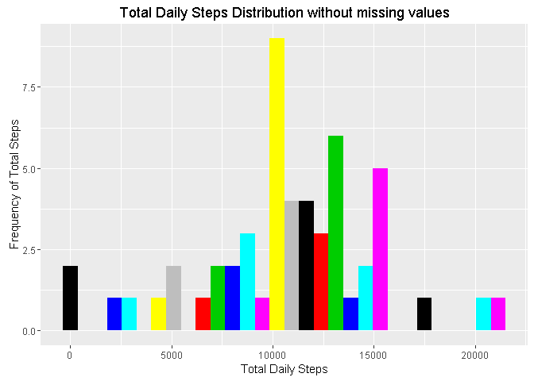
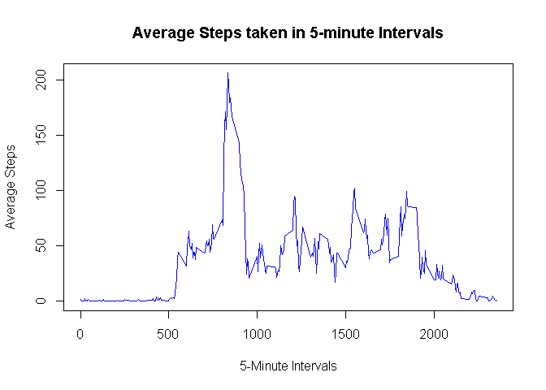
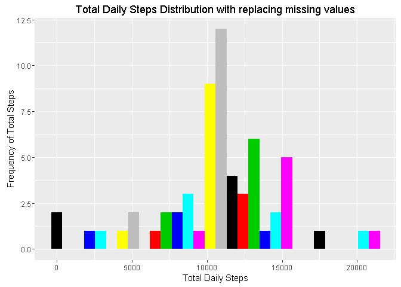

# Reproducible Research: Peer Assessment 1
by: Surya Gurung

## Loading the project data & ggplot2 library.


```r
library(ggplot2)
setwd('~/rprojects/RepData_PeerAssessment1') 
fName = "activity.zip"

# if the data is not downloaded yet, loads the zip data from given url.
if (!file.exists(fName)){
    fileURL <- 'https://d396qusza40orc.cloudfront.net/repdata%2Fdata%2Factivity.zip'
    download.file(fileURL, destfile = fName, method='curl')
}  

# unzip the downloaded data set file if it hasn't done yet.
if (!file.exists('activity.csv')){
    unzip(fName)
}

# reading 'activity.csv'
activityData <- read.csv('activity.csv', na.strings = 'NA')
```

## 1. What is mean total number of steps taken per day?

**Calculating total steps taken each day:**

```r
totalSteps <-  aggregate(steps ~ date, data = activityData, FUN = sum, na.rm = TRUE)
```

**Histogram of daily total steps taken:**

```r
plot1 <- ggplot(totalSteps, aes(x = steps)) 
plot1 + geom_histogram(bins = 30, fill = factor(1:30)) + 
    xlab('Total Daily Steps') + ylab('Frequency of Total Steps') + ggtitle('Total Daily Steps Distribution without missing values')
```

<!-- -->

**Mean of daily total number of steps:**

```r
mean(totalSteps$steps)
```

```
## [1] 10766.19
```
 
**Median of daily total number of steps:**

```r
median(totalSteps$steps)
```

```
## [1] 10765
```
## 2. What is the average daily activity pattern?

**Time series plot of 5-minute interval & average steps taken:**

```r
avgSteps <- aggregate(steps ~ interval, data = activityData, FUN = mean, na.rm = TRUE)
with(avgSteps, plot(interval, steps, type = 'l', col = 'blue', xlab = '5-Minute Interval', ylab = 'Average Steps'))
title('Average Steps taken in 5-minute Intervals')
```

<!-- -->

**Which 5-minute interval, on average across all the days in the dataset, contains the maximum number of steps?**  

**The 5-minute interval with maximum number of steps is:**


```r
maxValStep <- avgSteps[ which.max(avgSteps$steps), 'interval']
maxValStep
```

```
## [1] 835
```

**Number of steps at *835th* 5-minute interval is:**

```r
max(avgSteps$steps)
```

```
## [1] 206.1698
```
## 3. Imputing missing values.

**Total number of rows with NA value:**

```r
sum(is.na(activityData$steps))
```

```
## [1] 2304
```

**Replacing missing values ('NA') with average steps taken in corresponding interval.**

```r
mergedActivityData <- merge(activityData, avgSteps, by = 'interval')
naIndex <- which(is.na(mergedActivityData$steps.x))
mergedActivityData[naIndex, 'steps.x'] <- mergedActivityData[naIndex, 'steps.y']
modifiedTotalSteps <- aggregate(steps.x ~ date, data = mergedActivityData, FUN = sum)
```

**Plotting histogram of total daily steps

```r
plot1 <- ggplot(modifiedTotalSteps, aes(x = steps.x)) 
plot1 + geom_histogram(bins = 30, fill = factor(1:30)) + 
     xlab('Total Daily Steps') + ylab('Frequency of Total Steps') + ggtitle('Total Daily Steps Distribution with replacing missing values')
```

<!-- -->

```r
names(mergedActivityData)
```

```
## [1] "interval" "steps.x"  "date"     "steps.y"
```


```r
mean(modifiedTotalSteps$steps.x)
```

```
## [1] 10766.19
```

```r
median(modifiedTotalSteps$steps.x)
```

```
## [1] 10766.19
```


## 4. Are there differences in activity patterns between weekdays and weekends?
